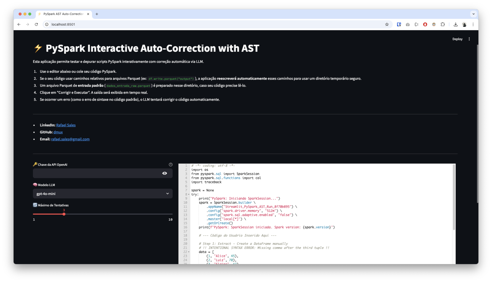
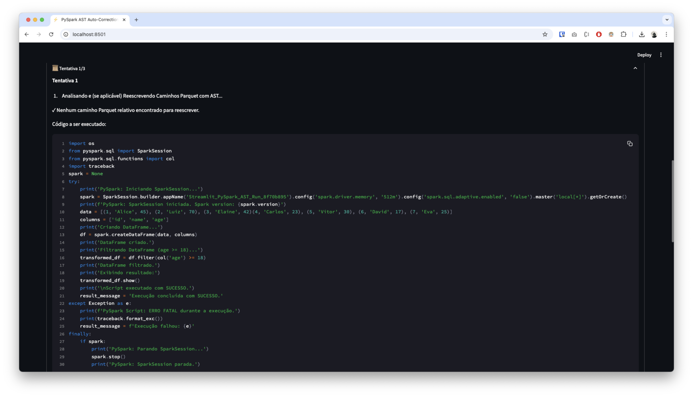
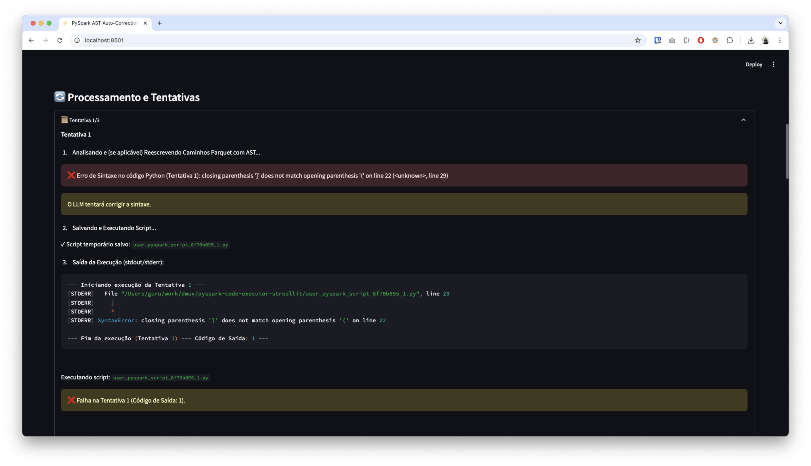
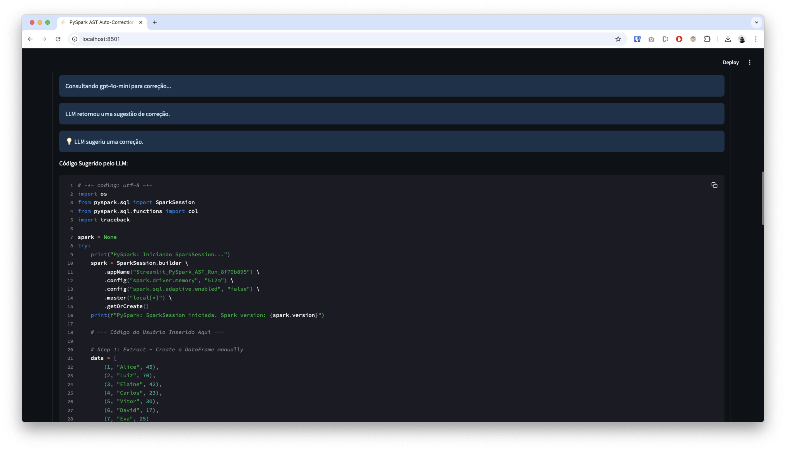

# ⚡ PySpark Interactive Auto-Correction with AST

[](https://www.python.org/downloads/)
[](https://opensource.org/licenses/MIT) <!-- Ou outra licença, se aplicável -->

Uma aplicação web Streamlit projetada para ajudar desenvolvedores e cientistas de dados a testar, depurar e executar interativamente scripts PySpark, com correção automática de erros alimentada por LLM e manipulação segura de caminhos de arquivos Parquet usando Abstract Syntax Trees (AST).

## Visão Geral

Trabalhar com PySpark muitas vezes envolve leitura e escrita de arquivos (especialmente Parquet). Gerenciar caminhos de arquivos, lidar com erros de sintaxe ou de tempo de execução e testar rapidamente pequenas alterações pode ser tedioso. Esta aplicação visa simplificar esse processo, fornecendo:

1.  **Um editor de código interativo:** Cole ou escreva seu script PySpark.
2.  **Execução em tempo real:** Veja a saída (stdout/stderr) do seu script PySpark enquanto ele roda.
3.  **Manipulação segura de caminhos Parquet:** Usa AST para reescrever automaticamente caminhos relativos `.parquet()` para usar um diretório temporário seguro e isolado para cada execução, prevenindo a sobrescrita acidental de dados e garantindo a limpeza.
4.  **Auto-Correção por LLM:** Se o script falhar (erro de sintaxe, erro de tempo de execução), a aplicação envia o código e o erro para um modelo LLM configurável (como GPT-4o-mini, GPT-4o) para sugerir uma correção.
5.  **Loop de Correção Iterativo:** Tenta executar o código corrigido, repetindo o processo por um número configurável de tentativas até o sucesso ou atingir o limite.
6.  **Gerenciamento de Ambiente:** Cria e limpa automaticamente ambientes de execução temporários.

## Funcionalidades Principais

- **Editor de Código PySpark:** Use o editor Ace integrado com destaque de sintaxe Python.
- **Execução Interativa:** Execute scripts PySpark diretamente da interface web.
- **Streaming de Saída:** Veja logs `stdout` e `stderr` em tempo real.
- **Reescrita Automática de Caminhos (AST):**
  - Analisa o código Python antes da execução.
  - Detecta chamadas `spark.read.parquet("caminho/relativo")` e `df.write.parquet("outro/caminho")`.
  - Reescreve os caminhos relativos para apontar para um diretório temporário único e absoluto (ex: `/tmp/temp_pyspark_st_run_xxxx/<caminho_original>`).
  - Garante o isolamento da execução e a segurança dos dados.
- **Correção por LLM (OpenAI):**
  - Integra-se com a API da OpenAI.
  - Envia código com falha e mensagem de erro para o modelo selecionado.
  - Analisa a resposta do LLM para extrair o código corrigido.
- **Loop de Tentativas Configurável:** Defina quantas vezes o LLM deve tentar corrigir o código.
- **Seleção de Modelo LLM:** Escolha entre diferentes modelos da OpenAI (GPT-4o-mini, GPT-4o, etc.).
- **Gerenciamento de Ambiente Temporário:** Cria automaticamente um diretório temporário para cada execução e o limpa posteriormente.
- **Preparação de Dados de Entrada (Opcional):** Pode gerar automaticamente um arquivo `dados_entrada_raw.parquet` de exemplo no diretório temporário para scripts que esperam ler dados.
- **Interface Amigável:** Construída com Streamlit para facilidade de uso.

## Demo YouTube

[](https://youtu.be/gACeCyfCOK4)

## Screenshots

### Editor, opções de configuração (API Key, Modelo, Tentativas), botões.



### A área de saída em tempo real com logs do PySpark.



### Um erro (ex: SyntaxError) capturado na saída.



### A sugestão de código corrigido fornecida pelo LLM.



### Uma execução bem-sucedida após a correção.


## Como Funciona

1.  **Entrada do Usuário:** O usuário insere ou edita o código PySpark no editor Ace.
2.  **Configuração:** O usuário fornece a chave da API OpenAI e seleciona o modelo LLM e o número máximo de tentativas.
3.  **Preparação do Ambiente (Ao clicar em "Corrigir e Executar"):**
    - Um diretório temporário único é criado no diretório temporário do sistema (ex: `/tmp/`).
    - (Opcional) Um arquivo Parquet de exemplo (`dados_entrada_raw.parquet`) é gerado dentro deste diretório temporário.
4.  **Loop de Tentativa (Iteração 1 a N):**
    - **Análise AST e Reescrita:** O código _atual_ (original ou corrigido pelo LLM da tentativa anterior) é analisado usando o módulo `ast` do Python. O `ParquetPathRewriter` visita a árvore e modifica nós de chamada `.parquet()` que usam strings literais de caminho relativo, substituindo-os por caminhos absolutos dentro do diretório temporário da execução atual.
    - **Salvar Script Modificado:** O código resultante _após a reescrita AST_ é salvo em um arquivo `.py` temporário.
    - **Execução:** O script `.py` modificado é executado como um subprocesso (`subprocess.Popen`) usando o mesmo interpretador Python do Streamlit. `stdout` e `stderr` são capturados em tempo real.
    - **Verificação de Saída:** O código de saída do subprocesso é verificado.
    - **Sucesso:** Se o código de saída for 0, o loop termina com sucesso.
    - **Falha:** Se o código de saída for diferente de 0 e o número máximo de tentativas não foi atingido:
      - O _código original_ da tentativa atual (antes da reescrita AST) e a _saída completa_ (stdout + stderr) são enviados para a API da OpenAI (usando o modelo selecionado).
      - A resposta do LLM é processada para extrair o bloco de código Python corrigido.
      - Se uma correção válida e diferente for recebida, o `current_code` é atualizado com a sugestão do LLM para a _próxima_ iteração do loop.
      - Se o LLM falhar, retornar o mesmo código ou nenhuma correção, o loop é interrompido.
    - **Feedback em Tempo Real:** A saída `stdout`/`stderr` é exibida usando `st.code` dentro de um `st.empty()` para atualizações ao vivo. Mensagens de status e o código a ser executado/corrigido são mostrados em `st.expander` para cada tentativa.
5.  **Resultado Final:** Uma mensagem de sucesso ou falha geral é exibida.
6.  **Limpeza:** O diretório temporário criado na etapa 3 é removido, juntamente com todos os arquivos Parquet gerados e scripts temporários.

## Requisitos

- **Python:** 3.9 ou superior (devido ao uso de `ast.unparse`)
- **Java Development Kit (JDK):** PySpark requer uma instalação Java funcional (geralmente JDK 8 ou 11+). Certifique-se de que `JAVA_HOME` esteja configurado corretamente em seu ambiente.
- **Bibliotecas Python:**
  - `streamlit`
  - `pandas`
  - `pyarrow` (para manipulação de Parquet)
  - `openai` (cliente oficial da OpenAI)
  - `pyspark`
  - `streamlit-ace` (para o editor de código)

## Instalação e Configuração

1.  **Clone o Repositório (se aplicável):**
    ```bash
    git clone <url-do-seu-repositorio>
    cd <diretorio-do-repositorio>
    ```
2.  **Crie um Ambiente Virtual (Recomendado):**
    ```bash
    python -m venv venv
    source venv/bin/activate  # Linux/macOS
    # ou
    venv\Scripts\activate    # Windows
    ```
3.  **Instale as Dependências:**
    Crie um arquivo `requirements.txt` com o seguinte conteúdo:
    ```txt
    streamlit
    pandas
    pyarrow
    openai>=1.0 # Use uma versão recente
    pyspark>=3.0 # Escolha uma versão compatível
    streamlit-ace
    ```
    Então instale:
    ```bash
    pip install -r requirements.txt
    ```
4.  **Obtenha uma Chave da API OpenAI:** Você precisará de uma chave válida da API OpenAI. Visite [platform.openai.com](https://platform.openai.com/) para obter uma.
5.  **Verifique a Instalação do Java:** Certifique-se de que o Java (JDK) está instalado e a variável de ambiente `JAVA_HOME` está configurada corretamente para que o PySpark possa encontrá-lo.

## Como Usar

1.  **Execute a Aplicação Streamlit:**
    ```bash
    streamlit run seu_script_streamlit.py
    ```
    (Substitua `seu_script_streamlit.py` pelo nome do seu arquivo Python principal).
2.  **Abra no Navegador:** O Streamlit geralmente abrirá a aplicação automaticamente no seu navegador padrão ou fornecerá um URL local (ex: `http://localhost:8501`).
3.  **Insira a Chave da API:** Cole sua chave da API OpenAI no campo correspondente na interface. A chave **não** é armazenada pela aplicação.
4.  **Configure (Opcional):** Selecione o modelo LLM desejado e ajuste o controle deslizante para o número máximo de tentativas de correção.
5.  **Adicione seu Código PySpark:** Cole seu script PySpark no editor ou modifique o código de exemplo fornecido.
    - **Importante:** Use **caminhos relativos** para quaisquer operações de leitura ou escrita de Parquet que você deseja que a aplicação gerencie (ex: `spark.read.parquet("data/input")`, `df.write.parquet("results")`). Caminhos absolutos não serão reescritos.
6.  **Execute:** Clique no botão "🚀 Corrigir e Executar".
7.  **Observe:** Acompanhe o progresso na seção "Processamento e Tentativas". Cada tentativa será exibida em um expansor, mostrando o código executado (após reescrita AST), a saída em tempo real e, se ocorrer falha, a tentativa de correção do LLM.
8.  **Limpeza Manual (Opcional):** Use o botão "🧹 Limpar Diretório Temporário Atual" se precisar remover manualmente o diretório temporário de uma execução anterior que pode não ter sido limpa corretamente (raro).

## Solução de Problemas (Troubleshooting)

- **Erro de Chave da API OpenAI:** Verifique se a chave está correta, ativa e se sua conta tem créditos/quota suficientes.
- **PySpark não inicia (`SparkSession` falha):**
  - Confirme se o Java (JDK) está instalado corretamente.
  - Verifique se a variável de ambiente `JAVA_HOME` está definida e aponta para a instalação correta do JDK.
  - Certifique-se de que as variáveis `PYSPARK_PYTHON` e `PYSPARK_DRIVER_PYTHON` (definidas no script) apontam para o executável Python correto (especialmente dentro de ambientes virtuais).
- **LLM não corrige o erro:**
  - O erro pode ser muito complexo para o modelo/prompt atual.
  - O modelo pode estar atingindo limites de taxa ou outros problemas da API.
  - Tente um modelo mais avançado (ex: GPT-4o em vez de GPT-4o-mini).
  - O erro pode não estar claramente representado na saída `stderr`/`stdout` capturada.
- **Problemas de Caminho Parquet:**
  - Certifique-se de estar usando caminhos _relativos_ no seu código PySpark para que o reescritor AST funcione.
  - Verifique os logs da aplicação Streamlit (console onde você executou `streamlit run`) para mensagens do `ParquetPathRewriter` se suspeitar de problemas na reescrita.
- **Erros de Dependência:** Certifique-se de que todas as bibliotecas listadas em `requirements.txt` foram instaladas corretamente no ambiente virtual ativo.
- **Erro `ast.unparse`:** Confirme que você está executando com Python 3.9 ou superior.

## Contribuições

Contribuições são bem-vindas! Sinta-se à vontade para abrir issues para relatar bugs ou sugerir melhorias. Se desejar contribuir com código, por favor, abra um Pull Request.

## Licença

Este projeto está licenciado sob a Licença MIT. Veja o arquivo `LICENSE` para mais detalhes (ou escolha outra licença).
